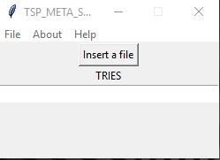

# Travelling-salesman-problem

## Definition
Given a list of nodes you need to find the best way to visit every node only once and return to the starting point with the lowest possible cost

#   VNS folder 

**Current Version**

 

**Radon**

## algorithms used

<ul>
 <li> 2-opt </li>
 <li> relocate </li>
 <li> swap </li>
</ul>